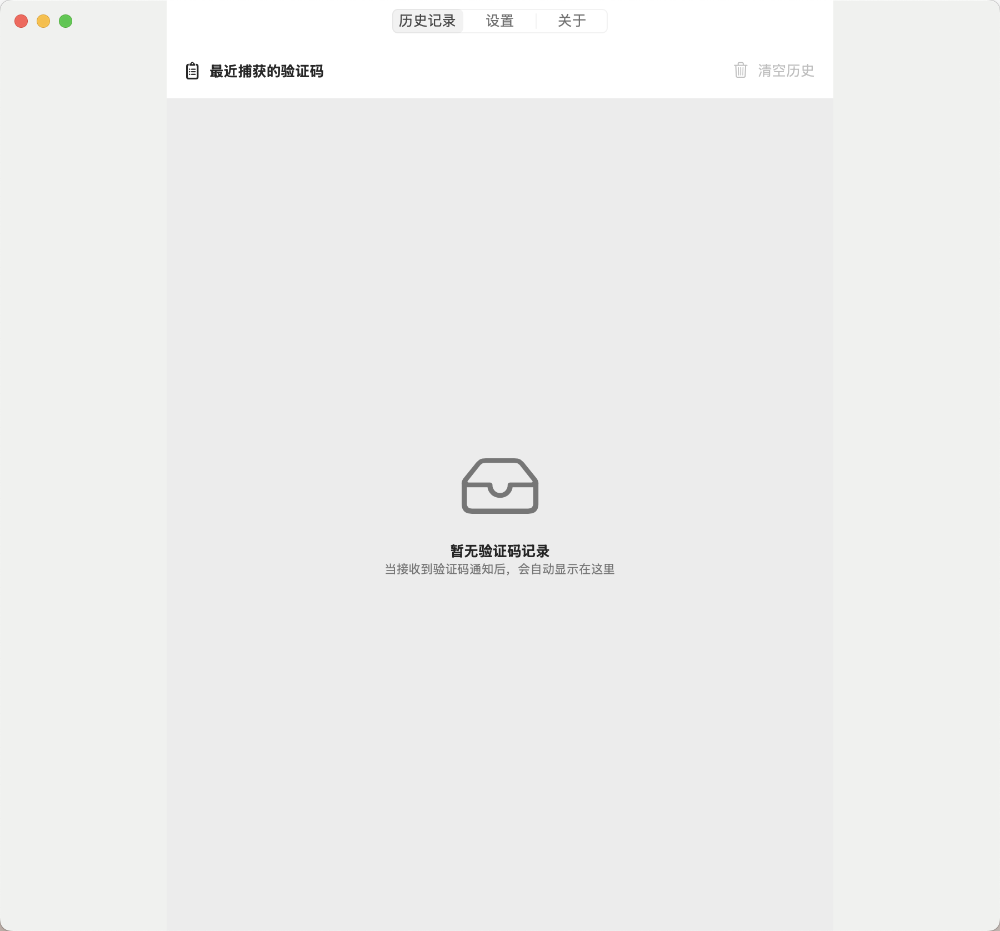
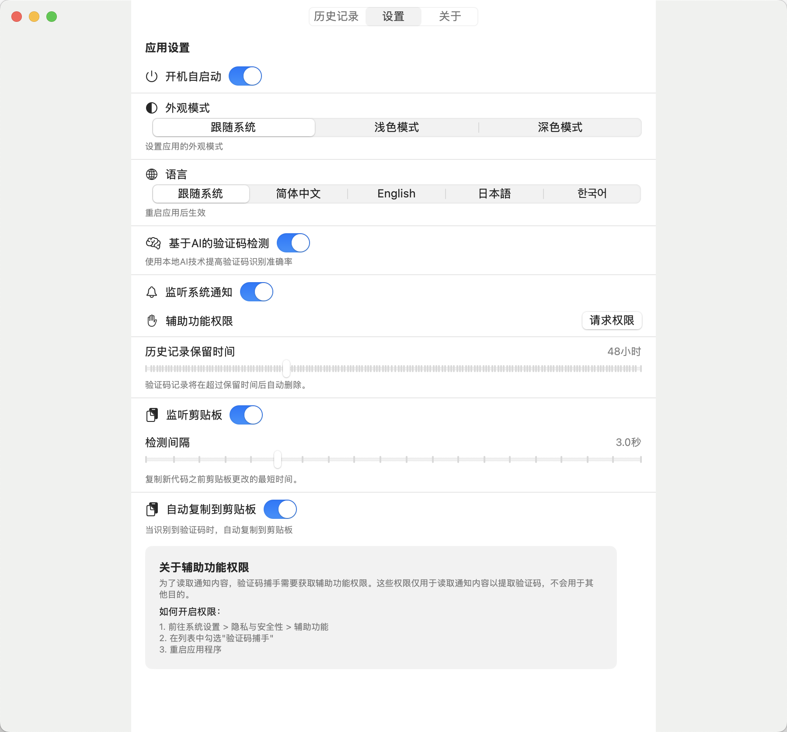
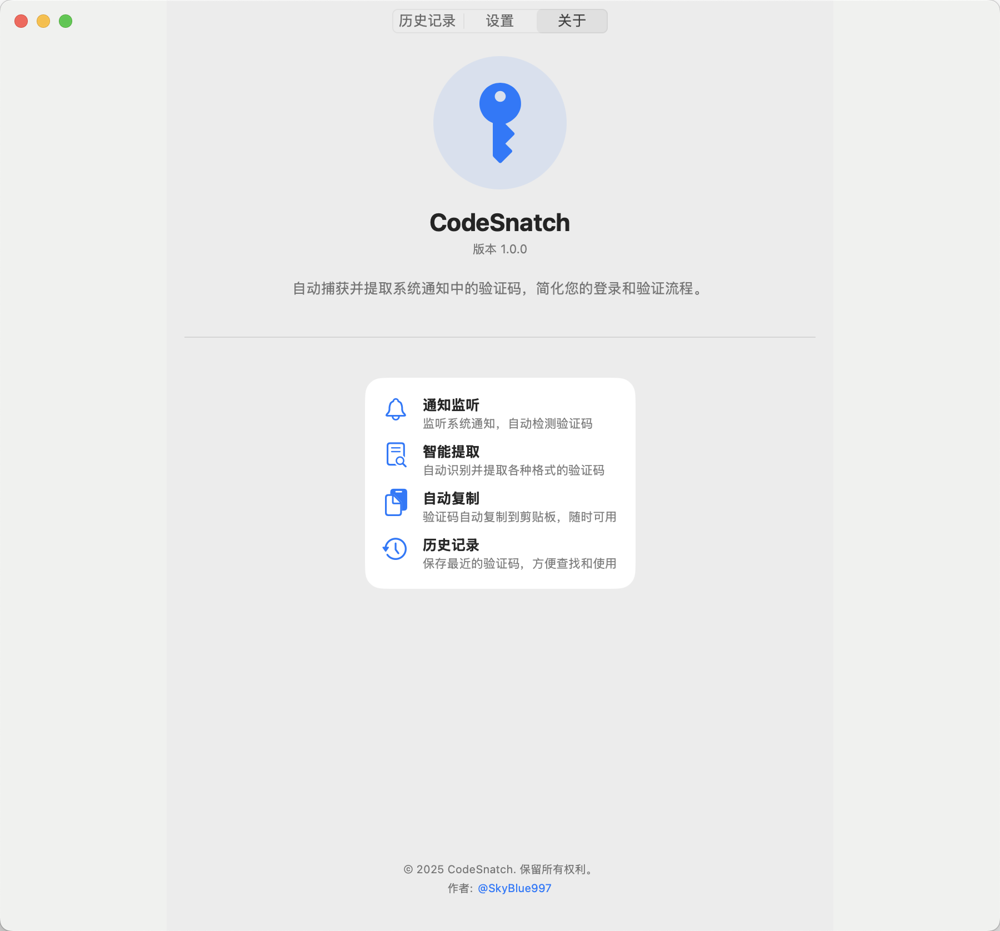

  

## 📱 CodeCatcher

  

## 📖 概述

CodeCatcher是一款基于Swift和SwiftUI开发的macOS高效验证码提取和管理工具，它能智能识别并自动捕获系统通知、剪贴板和短信中的验证码，为用户提供便捷的验证码复制和管理功能，大幅提高工作效率。

> 🔑 再也不用手动查找、记忆和输入验证码，CodeCatcher帮您自动完成！

  <table>
    <tr>
      <td></td>
      <td></td>
      <td></td>
    </tr>
    <tr>
      <td align="center">历史记录</td>
      <td align="center">设置</td>
      <td align="center">关于</td>
    </tr>
  </table>

## ✨ 主要功能

### 多渠道验证码捕获

- **系统通知监听** 📲：自动提取系统通知中的验证码
- **剪贴板监控** 📋：持续监控剪贴板内容，自动识别验证码
- **短信内容识别** 💬：读取短信数据库中的验证码（需授予权限）
- **图像通知识别** 🖼️：支持从包含图像的通知中提取验证码

### 智能验证码识别

- **AI智能识别** 🧠：
  - 使用本地NLP分析文本上下文
  - 基于Vision框架实现图像中的验证码识别
  - 多层次评分机制智能判断最可能的验证码
- **多模式识别** 🔍：
  - 正则表达式精准匹配
  - 上下文关键词分析
  - 支持多国语言的验证码识别

### 便捷用户体验

- **状态栏快速访问** 🔝：通过macOS状态栏随时查看和复制最近验证码
- **验证码历史记录** 📜：
  - 保存所有捕获的验证码
  - 可配置历史记录保留时间（1-168小时）
  - 支持按来源和时间筛选验证码
- **自动复制功能** ✂️：
  - 自动将最新验证码复制到剪贴板
  - 配置是否在捕获验证码时自动复制

### 高度可定制化

- **灵活设置选项** ⚙️：
  - 剪贴板监听间隔（0.5-10秒）
  - 历史记录保留时间
  - AI识别开关
  - 外观模式选择
  - 语言偏好设置
- **开机启动选项** 🚀：支持系统启动时自动运行应用

## 🖥️ 系统要求

- **操作系统**：macOS 13.0 或更高版本
- **处理器**：Apple Silicon 或 Intel 芯片的Mac设备
- **存储空间**：应用本身占用空间小于10MB
- **内存**：建议至少4GB RAM

## 🔒 隐私功能

为了提供完整的验证码捕获能力，应用需要以下权限：

| 权限 | 用途 | 必需性 |
|------|------|--------|
| **通知权限** | 读取系统通知中的验证码 | 必需 |
| **辅助功能权限** | 增强对通知内容的访问能力 | 推荐 |
| **完全磁盘访问权限** | 用于增强型短信监控功能 | 可选 |

> 💡 **注意**：所有数据均保存在本地，应用不会将您的验证码或个人信息发送到任何服务器

## 🚀 使用方法

1. **安装应用**：下载并安装CodeCatcher应用
2. **授予权限**：根据提示授予必要的系统权限
3. **启动应用**：应用将在状态栏显示图标
4. **验证码捕获**：
   - 当收到包含验证码的通知时，应用会自动提取
   - 复制包含验证码的文本到剪贴板时，应用会自动识别
   - 点击状态栏图标随时查看最新捕获的验证码
5. **使用验证码**：
   - 单击验证码即可复制
   - 或启用自动复制功能，在捕获时自动复制到剪贴板
6. **个性化设置**：通过主界面的设置选项自定义应用行为

## 🌈 特色功能详解

### 📊 验证码识别算法

应用采用多层次的验证码识别策略：

1. **AI智能识别**：
   - 通过自然语言处理分析文本上下文
   - 识别各种格式验证码的能力
   - 降低误判率的智能评分机制

2. **模式匹配**：
   - 针对常见验证码格式的正则表达式
   - 基于上下文的关键词匹配
   - 跨语言的验证码前缀识别

3. **图像识别**：
   - 使用Vision框架从图像中提取文本
   - OCR技术识别图像中的验证码

### 🌍 多语言支持

支持多种语言界面：

- 简体中文（默认）
- 英文
- 日语
- 韩语
- 其他语言可通过本地化文件添加

应用会自动适应系统语言，也可在设置中手动切换。

### 🎨 个性化外观

支持多种界面外观模式：

- **跟随系统**：自动适应系统深色/浅色模式
- **深色模式**：降低眼睛疲劳，节省电量
- **浅色模式**：传统界面风格

## 📚 使用场景

- **网站注册与登录**：自动捕获注册、登录时收到的验证码
- **银行与金融应用**：捕获在线交易、支付时的验证码
- **账户安全验证**：捕获双因素认证过程中的验证码
- **应用程序注册**：捕获移动应用注册时的验证码

## 📦 安装方法

### 方法一：直接下载

1. 从[发布页面](#)下载最新版本
2. 解压下载的文件
3. 将应用拖入应用程序文件夹

### 方法二：自行构建

详细的构建说明请参阅 [BUILDING.md](BUILDING.md) 文件。

### 开发者选项

开发者可以扩展应用的功能：
- 添加新的验证码模式识别
- 增强AI识别能力
- 添加新的验证码来源

## 👥 贡献指南

欢迎为CodeCatcher项目做出贡献！您可以通过以下方式参与：

1. 提交问题和功能请求
2. 改进代码和修复bug
3. 添加新功能和扩展
4. 改进文档和翻译

请确保遵循项目的代码风格和提交规范。

---

**CodeCatcher** - 让验证码管理变得简单高效

